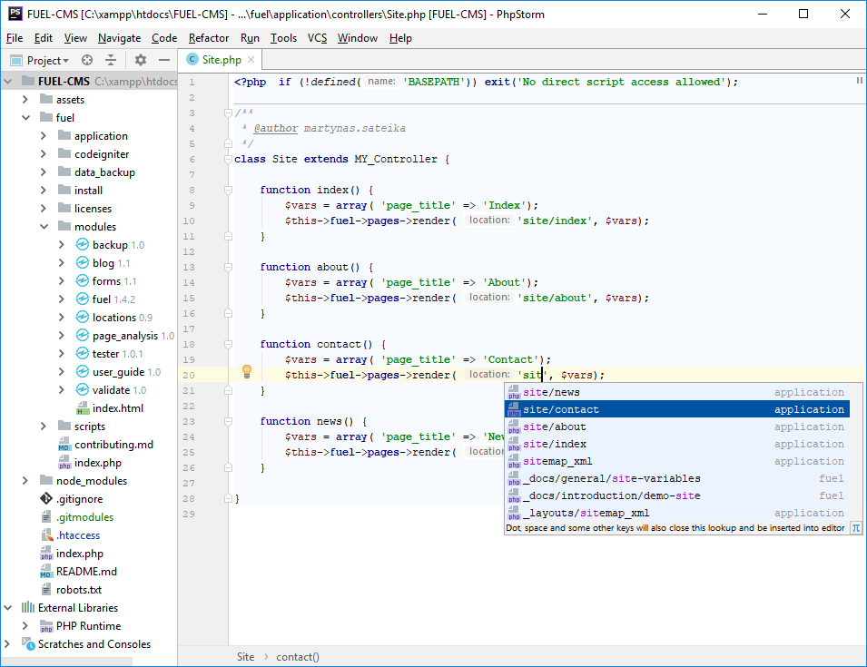

[![changelog][changelog-badge]][CHANGELOG]
[![version][jetbrains-version-badge]][PLUGIN]
[![downloads][downloads-badge]][PLUGIN]
[![license][license-badge]][LICENSE]

FuelCMS Plugin for PhpStorm
========================

Installation
---------------------
* Install the plugin by going to `Settings -> Plugins -> Browse repositories` and searching for "FuelCMS".
* Enable it in your project by going to `File -> Settings -> Languages & Frameworks -> PHP -> FUEL CMS`.

Attributions
------------
* The module is built for use with [FUEL CMS](https://github.com/daylightstudio/FUEL-CMS), a framework built by David McReynolds, licenced under [Apache 2](http://www.apache.org/licenses/LICENSE-2.0.html).

[CHANGELOG]: ./CHANGELOG.md
[LICENSE]: ./LICENSE
[PLUGIN]: https://plugins.jetbrains.com/plugin/10245
[changelog-badge]: https://img.shields.io/badge/changelog-blue.svg
[jetbrains-version-badge]: https://img.shields.io/jetbrains/plugin/v/10245-fuelcms-plugin.svg
[downloads-badge]: https://img.shields.io/jetbrains/plugin/d/10245-fuelcms-plugin.svg
[license-badge]: https://img.shields.io/badge/license-Apache%202.0-blue.svg
